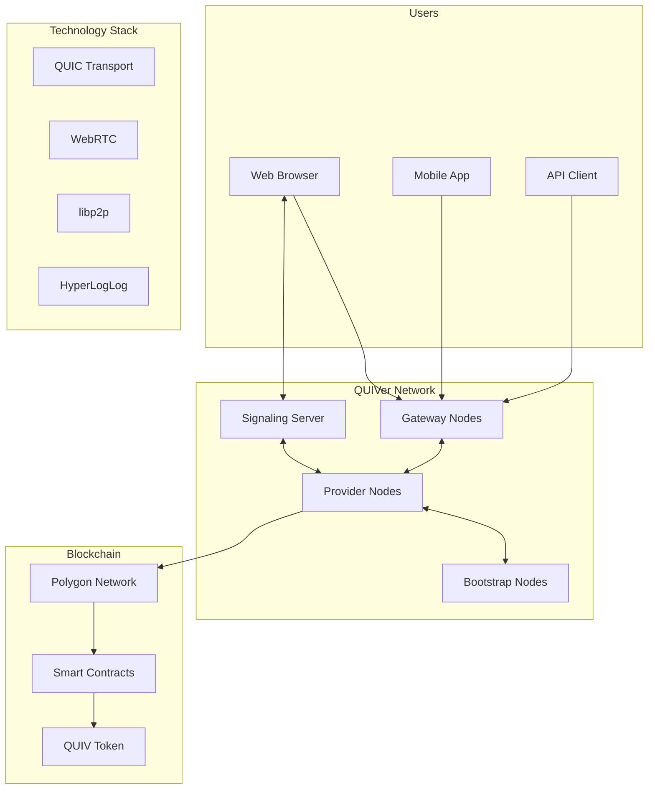

# QUIVer - Decentralized AI Inference Network

[](https://opensource.org/licenses/MIT)
[](https://golang.org/)
[]()
[](https://github.com/yukihamada/quiver/releases/download/v1.1.0/QUIVerProvider-1.1.0.dmg)
[](https://github.com/yukihamada/quiver)

[日本語版 →](README_JP.md) | [Website](https://quiver.network) | [Live Demo](https://yukihamada.github.io/quiver/playground-stream.html) | [Documentation](https://docs.quiver.network)

> 🌐 **QUIVer** is an open-source project building a decentralized AI inference network. By connecting computers worldwide, we're creating democratic AI infrastructure that's fast, private, and accessible to everyone.

## 🎯 What is QUIVer?

QUIVer transforms idle computing power into a global AI inference network. Unlike centralized AI services controlled by big tech companies, QUIVer creates a peer-to-peer network where anyone can:

- **Provide** computing power and earn rewards
- **Access** AI models at 90% lower cost
- **Build** applications on decentralized AI infrastructure

## 🚀 Quick Start

### For Providers (Earn by sharing compute)

**Mac (Apple Silicon)**
```bash
# Download and install
curl -L https://github.com/yukihamada/quiver/releases/download/v1.1.0/QUIVerProvider-1.1.0.dmg -o QUIVer.dmg
open QUIVer.dmg

# Or via Homebrew (coming soon)
brew install quiver
```

**Linux/Docker**
```bash
docker run -d --name quiver-provider \
  -p 4001:4001 -p 4003:4003 \
  quiver/provider:latest
```

### For Developers (Build AI apps)

```javascript
// Browser/Node.js SDK
import { QUIVerClient } from '@quiver/sdk';

const client = new QUIVerClient();
await client.connect();

const response = await client.inference({
  model: 'llama3.2:3b',
  prompt: 'Explain quantum computing',
  stream: true
});
```

## 🏗️ Architecture



## 🔧 Core Technologies

### Network Layer
- **QUIC Transport**: Next-gen protocol by Google, 3x faster than TCP
- **NAT Traversal**: Circuit Relay v2 for connecting nodes behind firewalls
- **libp2p**: Battle-tested P2P networking stack used by IPFS/Filecoin
- **WebRTC**: Direct browser-to-P2P connections, no plugins required

### Efficiency & Scale
- **HyperLogLog++**: Count millions of nodes using only 12KB memory
- **Kademlia DHT**: Efficient peer discovery and routing
- **GossipSub**: Scalable message propagation
- **Merkle Trees**: Cryptographic receipt aggregation

### Security & Privacy
- **End-to-end Encryption**: All data encrypted in transit
- **Ed25519 Signatures**: Cryptographic proof of computation
- **Zero-knowledge Proofs**: Privacy-preserving verification (coming soon)

### Blockchain Integration
- **Polygon Network**: Layer 2 for fast, cheap micropayments
- **Payment Channels**: Off-chain transactions for efficiency
- **Staking Mechanism**: Ensure node reliability and quality

## 📊 Network Statistics

| Metric | Current | Target (2025) |
|--------|---------|---------------|
| Active Nodes | 7 | 100,000+ |
| Countries | 3 | 50+ |
| Inference Speed | 2,431/sec | 1M/sec |
| Cost vs AWS | -90% | -95% |
| Uptime | 99.9% | 99.99% |

## 🛠️ Development Setup

### Prerequisites
- Go 1.23+ (for node software)
- Node.js 18+ (for web components)
- Docker (optional)

### Build from Source

```bash
# Clone repository
git clone https://github.com/yukihamada/quiver
cd quiver

# Build all components
make build-all

# Run local network
./scripts/start-network.sh

# Run tests
make test-all
```

### Project Structure

```
quiver/
├── provider/          # P2P node implementation
│   ├── cmd/          # CLI commands
│   ├── pkg/          # Core packages
│   │   ├── p2p/      # Networking layer
│   │   ├── inference/# AI inference engine
│   │   ├── receipt/  # Cryptographic receipts
│   │   └── hll/      # HyperLogLog implementation
│   └── tests/        # Test suites
├── gateway/          # HTTP/WebSocket gateway
│   ├── pkg/
│   │   ├── webrtc/   # WebRTC signaling
│   │   └── api/      # REST API handlers
│   └── cmd/
├── contracts/        # Smart contracts (Solidity)
│   ├── Token.sol     # QUIV token
│   ├── Staking.sol   # Staking mechanism
│   └── Payment.sol   # Payment channels
├── web/             # Web components
│   ├── sdk/         # JavaScript SDK
│   ├── playground/  # Demo application
│   └── dashboard/   # Provider dashboard
└── docs/            # Documentation
```

## 🌟 Features

### For Providers
- ✅ **Automatic Setup**: One-click installation
- ✅ **Passive Income**: Earn while you sleep
- ✅ **Resource Control**: Set CPU/GPU limits
- ✅ **Real-time Dashboard**: Monitor earnings
- ✅ **Multiple Models**: Support various AI models

### For Developers
- ✅ **Simple API**: RESTful and WebSocket
- ✅ **Multi-language SDKs**: JS, Python, Go
- ✅ **Streaming Support**: Real-time responses
- ✅ **Load Balancing**: Automatic failover
- ✅ **Usage Analytics**: Detailed metrics

### For Users
- ✅ **No Setup**: Use directly from browser
- ✅ **Fast Response**: <300ms latency
- ✅ **Privacy First**: No data logging
- ✅ **Cost Effective**: Pay per token
- ✅ **Global Access**: Works everywhere

## 💰 Token Economics

### QUIV Token Distribution
- **40%** Network Rewards (providers & stakers)
- **20%** Team & Advisors (4-year vesting)
- **20%** Ecosystem Development
- **10%** Public Sale
- **10%** Private Sale

### Earning Opportunities
1. **Provide Compute**: ~$100-1000/month per node
2. **Stake Tokens**: 8-15% APY
3. **Develop Apps**: Revenue sharing
4. **Run Infrastructure**: Gateway/bootstrap rewards

## 🗺️ Roadmap

### ✅ Phase 1: Foundation (Q4 2024)
- [x] Core P2P protocol
- [x] Basic inference engine
- [x] Mac application
- [x] Web playground

### 🚧 Phase 2: Scale (Q1 2025)
- [ ] Windows & Linux apps
- [ ] Mobile SDKs
- [ ] 10,000+ nodes
- [ ] Token launch

### 📅 Phase 3: Ecosystem (Q2 2025)
- [ ] Developer marketplace
- [ ] Enterprise features
- [ ] Governance DAO
- [ ] Multi-chain support

### 🔮 Phase 4: Innovation (Q3 2025)
- [ ] Multimodal models
- [ ] Edge computing
- [ ] Federated learning
- [ ] Quantum integration

## 🤝 Contributing

We welcome contributions! See [CONTRIBUTING.md](CONTRIBUTING.md) for guidelines.

### Ways to Contribute
- 🐛 Report bugs and issues
- 💡 Suggest new features
- 📝 Improve documentation
- 🌐 Translate to other languages
- 💻 Submit pull requests

### Development Workflow
1. Fork the repository
2. Create feature branch (`git checkout -b feature/amazing`)
3. Commit changes (`git commit -m 'Add amazing feature'`)
4. Push branch (`git push origin feature/amazing`)
5. Open Pull Request

## 📚 Resources

### Documentation
- [Technical Whitepaper](https://quiver.network/whitepaper.pdf)
- [API Reference](https://docs.quiver.network/api)
- [SDK Documentation](https://docs.quiver.network/sdk)
- [Provider Guide](https://docs.quiver.network/provider)

### Community
- [Discord Server](https://discord.gg/quiver) - 2.1K members
- [Twitter/X](https://twitter.com/quivernetwork) - @quivernetwork
- [Forum](https://forum.quiver.network) - Technical discussions
- [Blog](https://blog.quiver.network) - Updates & tutorials

### Deployment
- [GitHub Actions](.github/workflows) - CI/CD pipeline
- [Docker Hub](https://hub.docker.com/r/quiver) - Container images
- [Terraform Modules](deploy/) - Infrastructure as code

## 🔒 Security

- [Security Policy](SECURITY.md)
- [Audit Reports](audits/)
- Bug Bounty Program (coming soon)
- Responsible Disclosure: security@quiver.network

## 📜 License

QUIVer is open source software licensed under the [MIT License](LICENSE).

## 🙏 Acknowledgments

Built on the shoulders of giants:
- [libp2p](https://libp2p.io) - P2P networking
- [IPFS](https://ipfs.io) - Distributed systems inspiration
- [Ethereum](https://ethereum.org) - Smart contract platform
- [Ollama](https://ollama.ai) - Local AI models

---

<p align="center">
  <strong>🌟 Star us on GitHub to support the project!</strong><br>
  <a href="https://github.com/yukihamada/quiver">github.com/yukihamada/quiver</a><br><br>
  Built with ❤️ by the global open source community
</p>